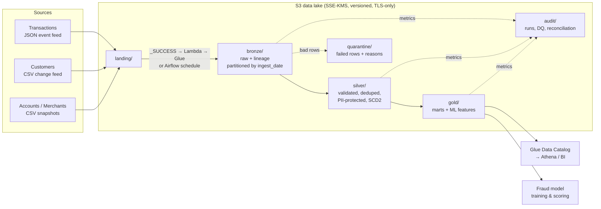

# Architecture

## Data flow

## Layers

| Layer | Contents | Write pattern | Partitioned by |
|---|---|---|---|
| landing | Files exactly as delivered | Upstream system | `ingest_date` |
| bronze | Typed against an explicit schema, plus `_ingest_ts`, `_source_file`, `_batch_id`. Unparseable rows go to `quarantine/<source>_unparseable`. | Dynamic partition overwrite | `ingest_date` |
| silver | `transactions`: standardised, deduplicated in-batch and across batches, validated, FX-converted. `customers_scd2`: Type 2 history with PII hashed/masked. `accounts`, `merchants`: latest valid snapshot. | Partition overwrite / full replace | `ingest_date` |
| gold | `customer_daily_spend`, `merchant_category_daily`, `txn_fraud_features` | Dynamic partition overwrite | `txn_date` / `ingest_date` |
| quarantine | Every rejected row with its `_dq_errors` reasons, and dropped duplicates | Partition overwrite | `ingest_date` |
| audit | `pipeline_runs`, `dq_results`, `reconciliation` | Append | none |

## Design decisions

**Idempotent by construction.** Every write either replaces exactly the partitions for the
run date (`partitionOverwriteMode=dynamic`) or fully replaces a derived table. Re-running a
day, an Airflow retry, or a backfill gives the same result. `test_rerun_is_idempotent`
asserts this.

**Silver transactions are partitioned by `ingest_date`, not `txn_date`.** About 2% of
transactions arrive 1–2 days late. If silver were partitioned by event date, reprocessing
one batch would overwrite partitions that also hold rows from other batches. Partitioning by
delivery date keeps each batch in its own partition. Gold then recomputes every `txn_date`
the batch touched, so late events are reflected in the marts.

**Two levels of deduplication.** In-batch duplicates (a replayed file) are removed with a
`row_number()` window. Cross-batch replays are removed with a `left_anti` join against the
txn_ids published in the last `late_arrival_days`. Dropped duplicates go to quarantine, so
they still count in reconciliation.

**Quality gates before publish.** Rules are declared in YAML and evaluated in a single pass.
Error-severity failures are quarantined, warnings are only counted, and a `max_error_rate`
circuit breaker fails the batch before anything reaches silver.

**Reconciliation re-reads storage.** After writing, the job reads silver, quarantine and
duplicates back from storage and checks that row counts and amount totals equal the bronze
batch. This catches problems the in-memory plan would hide, such as partial writes or bad
partition filters.

**SCD2 handles real feeds.** Out-of-order change records (older than the current version) are
counted as stale and ignored instead of rewriting history. Re-applying the same feed is a
no-op because change detection compares a hash of the tracked columns.

**PII is protected at the bronze→silver boundary.** Email is SHA-256 hashed after
normalisation, so it can still be joined. Phone is masked to its last four digits. Names are
dropped. Bronze is restricted-access raw data, and silver and gold contain no direct identifiers.

**Fraud features use no look-ahead.** Window frames end at `-1` second, so each
transaction's features come only from earlier activity. Training and online scoring
therefore see the same values.

**Same code everywhere.** The Airflow DAG, the Glue job and the tests all call
`lakehouse.pipeline.run`. The Glue script only translates job arguments.

## Production next steps

* **Table format:** move from Parquet to Delta Lake or Apache Iceberg. That gives ACID
  `MERGE` for SCD2 and dedupe (replacing the staging-and-swap in `replace_table`), time travel
  for audit, and safe concurrent writers.
* **Late data beyond the window:** route events later than `late_arrival_days` to a
  dedicated reprocessing path instead of relying on the window.
* **Data contracts:** publish source schemas and DQ rules as versioned contracts with the
  upstream teams.
* **Lineage:** emit OpenLineage events from each stage to a catalog.
